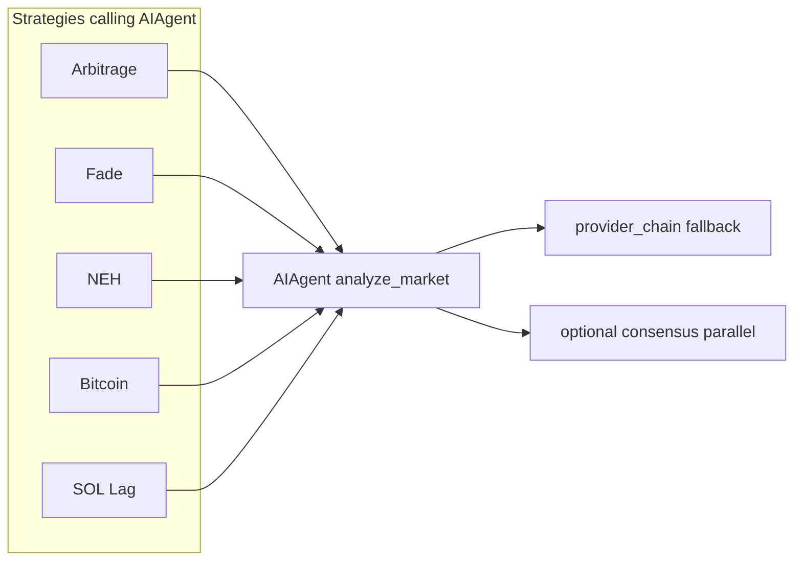
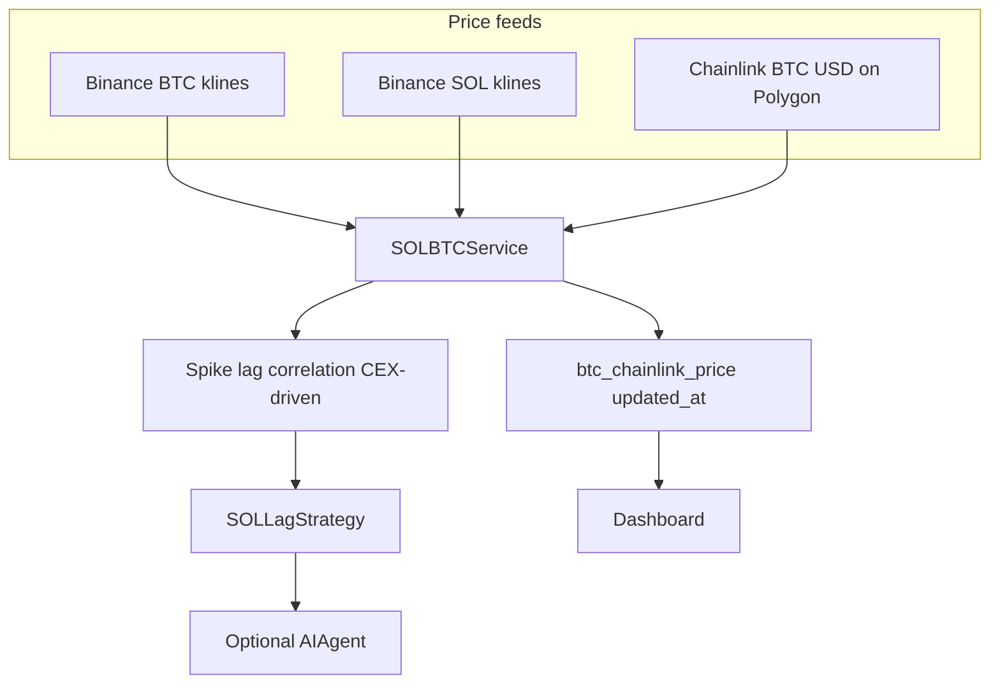

# AI strategies and SOL / Chainlink pipeline (diagrams)

Open this file in Cursor and use **Markdown preview** (or split preview) to render the diagrams below. The hidden plan under `.cursor/plans/` does not always preview the same way as normal project docs.

---

## 1. Strategies calling `AIAgent`

---

## 2. SOL pipeline hub: Binance + Chainlink (spider-style)

`SOLBTCService` ([`src/analysis/sol_btc_service.py`](../src/analysis/sol_btc_service.py)) pulls **three** inputs: Binance BTC klines, Binance SOL klines, and **Chainlink BTC/USD** on Polygon. Spike/lag logic uses **CEX** series; Chainlink adds **on-chain BTC/USD** and timestamp for verification and the dashboard.

---

## Summary

| Source | Role in SOL strategy |
|--------|----------------------|
| Binance BTC/SOL klines | Drives `btc_spike_detected`, SOL lag, `correlation_1h`, etc. |
| Chainlink on Polygon | `get_chainlink_btc_price()` → `btc_chainlink_price` / `btc_chainlink_updated_at` on the same correlation object (verification + UI; not the primary series for % moves) |

See also [`docs/AI_PROVIDER_INTEGRATION.md`](AI_PROVIDER_INTEGRATION.md).
