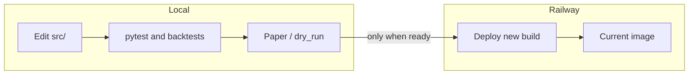

# PSB improvement backlog and handoff

Canonical copy of the improvement backlog, local-first deploy workflow, and Claude Code handoff. The Obsidian-ready short note lives in the Hermes vault at `Hermes Second Brain/projects/psb/notes/2026-04-21-psb-improvement-backlog-and-local-first-deploy.md` (same machine) and can be synced from there.

## Local bot first, Railway later

Local edits do **not** update Railway until you **push**, run **`railway up`**, or trigger a deploy. Use **pytest**, **backtests**, and **paper / `dry_run`** before promoting. After deploy, confirm `GET /health` matches [`src/dashboard/server.py`](../src/dashboard/server.py) `dashboard_ui_rev` and optional `git_sha` — see [RAILWAY.md](RAILWAY.md).

## Your next step: pick one pillar

Record the pillar you will tackle first (one at a time for core changes):

| Pillar                         | Primary paths |
|--------------------------------|---------------|
| Execution / risk               | `src/execution/clob_client.py`, `exposure_manager.py`, kill switch + `src/main.py` |
| Journal / disk                 | `src/execution/trade_journal.py`, dashboard disk reads in `src/dashboard/server.py` |
| Strategies / scanner           | `src/strategies/*`, `src/market/scanner.py`, `src/market/websocket.py` |
| Kelly / sizing                 | `src/analysis/kelly_sizer.py`, call sites in `src/main.py` |
| AI / usage                     | `src/analysis/ai_agent.py`, `src/ai_status.py`, `src/analysis/usage_tracker.py` |
| Notifications                  | `src/notifications/notification_manager.py` |
| Backtest                       | `src/backtest/*` |
| Observability                  | `src/ops_pulse.py`, logging in `src/main.py` |
| Config / secrets               | `config/settings.yaml`, `src/config_merge.py`, `src/env_bootstrap.py` |

**Chosen pillar (fill in):** ___________________

**Exit criteria for Railway promote:** pytest green, relevant `scripts/run_backtest_*.py` if strategies/backtest touched, paper session check, `/health` + journal endpoints spot-check.

## Dashboard track already shipped (low coupling to trading)

- SSE-driven Command Center heroes; slower `fetchAll`; extended `sse_stream` parity in `src/dashboard/server.py`.
- Optional Scalar (`SCALAR_ENABLED`), Sentry (`SENTRY_DSN`, `SENTRY_BROWSER_DSN`), HTMX health snippet, Alpine/HTMX CDNs.
- `tools/api/dashboard.http` for REST Client workflows.

Trading loop in `src/main.py` was not the primary target of that work.

## Detailed backlog (non-dashboard — higher coupling / risk)

### Execution, risk, and CLOB

- **Focus:** `src/execution/clob_client.py` (`RiskManager`, `CLOBClient`), `src/execution/exposure_manager.py`, `data/KILL_SWITCH`, `src/main.py`.
- **Why:** Gates and sizing directly affect PnL and tail risk.
- **What:** Audit `can_trade`, emergency stop, limits, idempotency on place/cancel, `py-clob-client` error paths.
- **How:** [STRATEGY_ENTRY_SPEC.md](STRATEGY_ENTRY_SPEC.md), [HANDOFF_STRATEGY_ENTRY_AND_BACKTEST.md](HANDOFF_STRATEGY_ENTRY_AND_BACKTEST.md); add tests under `tests/`; paper with order-path logging.
- **Risk:** High.

### Journal and disk truth

- **Focus:** `src/execution/trade_journal.py`, `src/dashboard/server.py` (positions.json, sessions under `data/`).
- **Why:** Hosted redeploys wipe disk without a Railway volume on `/app/data`; resume uses `TradeJournal(resume_latest=True)`.
- **What:** Invalidation, single-writer assumptions, in-memory vs `positions.json` parity; document volume strategy if continuity matters.
- **How:** Restart scenarios locally; integration tests with temp dirs; `/api/journal/summary` vs live.
- **Risk:** Medium–high for integrity.

### Strategies and scanner

- **Focus:** `src/strategies/*.py`, `src/market/scanner.py`, `src/market/websocket.py`.
- **Why:** Slug/feed changes cause regressions; edge lives in signal quality.
- **What:** Align live with backtest; follow strategy log in `AGENTS.md` (`projects/polymarket-bot/strategy-log/`).
- **How:** `scripts/run_backtest_crypto.py`; [polymarket-backtest-subagent-skill.md](polymarket-backtest-subagent-skill.md); extend `tests/test_strategies.py` / scenarios.
- **Risk:** High for logic changes; vault “15+ closed trades” rule.

### Kelly and sizing

- **Focus:** `src/analysis/kelly_sizer.py`, `src/main.py`.
- **Why:** Sizing drives drawdown; window stats must match reporting.
- **What:** Dashboard Kelly vs in-bot; property tests on fraction bounds.
- **How:** Unit tests + journal streaks; sensitivity backtests.
- **Risk:** Medium–high.

### AI / LLM path

- **Focus:** `src/analysis/ai_agent.py`, `src/ai_status.py`, `src/analysis/usage_tracker.py`, `ai.live_inferencing` in config.
- **Why:** Cost, latency, operator confusion (paused vs off).
- **What:** Timeouts, retries, caching; dashboard AI badge accuracy.
- **How:** `tests/test_ai_status.py`, logs, quota checks.
- **Risk:** Low–medium unless AI gates execution.

### Notifications

- **Focus:** `src/notifications/notification_manager.py`; Discord allowlist in `AGENTS.md`.
- **Why:** Noise vs missed fills.
- **What:** Execution-only contract; extend `tests/test_notification_manager.py` when adding strategies to allowlist.
- **Risk:** Low–medium.

### Backtest engine and reports

- **Focus:** `src/backtest/engine.py`, `src/backtest/updown_engine.py`, loaders.
- **Why:** Bad backtests mislead tuning.
- **What:** Parity with live journal; OHLCV 451 / partial-day cache (see `AGENTS.md`).
- **How:** `tests/test_backtest_engine.py`, crypto tests, fixed-seed script runs.
- **Risk:** Medium for engine changes.

### Observability and ops

- **Focus:** `src/ops_pulse.py`, `src/main.py` logging; Sentry today initializes in `src/dashboard/server.py` on import.
- **Why:** “Why didn’t it trade?” needs OPS_JSON / `/api/ops/summary` / risk blocks.
- **What:** Correlate ops pulse with idle reasons; optional Sentry for bot thread errors.
- **How:** Structured logs, `docs/` runbooks.
- **Risk:** Low if additive; mind PII.

### Config and secrets

- **Focus:** `config/settings.yaml`, `src/config_merge.py`, `src/env_bootstrap.py`, `tests/test_config_merge.py`.
- **Why:** Local vs hosted drift.
- **What:** Document env; startup validation.
- **How:** Merge tests; optional schema later.
- **Risk:** Low–medium.

## Handoff for Claude Code

- **Repo:** PSB (`psb-main 1`); process and strategy rules in [AGENTS.md](../AGENTS.md).
- **Recent dashboard work:** SSE heroes, polling, Scalar/Sentry optional, HTMX snippet, `tools/api/dashboard.http`; bump `dashboard_ui_rev` when changing dashboard HTML/JS.
- **User intent:** Core bot work **after** pillar choice; **local + paper** before Railway.
- **Verify:** `pytest`, relevant backtest scripts, paper, then `/health` and journal APIs before deploy.

## Pre–Railway promote checklist (automation-friendly)

1. `cd` repo root; ensure dev test deps: `pip install -r requirements-dev.txt` (needed for `pytest-asyncio`); run `.venv/bin/python -m pytest`.
2. If strategies/backtest touched: run the relevant `scripts/run_backtest_*.py` from `AGENTS.md`.
3. Paper / `dry_run` session long enough to exercise changed paths.
4. Deploy; curl `/health` and compare `dashboard_ui_rev` / `git_sha` to expectation.
